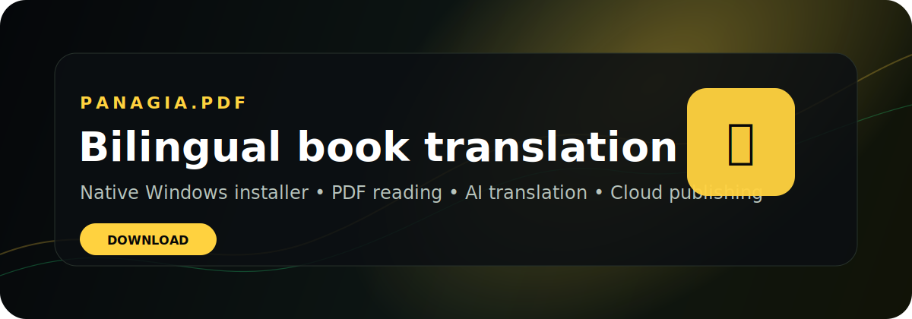

<p align="center">
  
</p>

<h1 align="center">Panagia.pdf</h1>

<p align="center">
  <strong>Native Windows desktop app for bilingual book translation, PDF reading, AI-assisted workflows, and cloud publishing.</strong>
</p>

<p align="center">
  <a href="https://github.com/ydkm24/panagia-pdf-releases/releases/latest"></a>
  <a href="https://github.com/ydkm24/panagia-pdf-releases/releases/latest"></a>
  <a href="checksums/v0.1.0-SHA256SUMS.txt"></a>
  <a href="#community"></a>
</p>

---

## Install

<p>
  <a href="https://github.com/ydkm24/panagia-pdf-releases/releases/latest">
    
  </a>
</p>

<details open>
<summary><strong>Windows</strong></summary>

1. Open the [latest release](https://github.com/ydkm24/panagia-pdf-releases/releases/latest).
2. Download `Panagia.pdf_Setup.exe`.
3. Run the installer.
4. Launch **Panagia.pdf** from the Start Menu or Desktop shortcut.

</details>

> The installer is distributed as a GitHub Release asset. The application source code is **not** stored in this repository.

---

## Features

<table>
<tr>
<td width="50%">

### 📖 PDF Reading Workspace

Read and manage book projects in a native desktop window built for long-form PDF workflows.

</td>
<td width="50%">

### 🌐 Bilingual Translation

Translate books page-by-page while preserving project state and translation progress.

</td>
</tr>
<tr>
<td width="50%">

### ☁️ Cloud Publishing

Publish completed books to the cloud library and keep local project metadata in sync.

</td>
<td width="50%">

### 👤 Account & Profiles

Persistent login, user profiles, subscription-aware account state, and activity stats.

</td>
</tr>
<tr>
<td width="50%">

### 🛠 Native Windows Installer

Packaged for Windows with desktop shortcuts, Start Menu entries, and uninstall support.

</td>
<td width="50%">

### 🔒 Release Verification

Checksums and manifests are included so downloads can be verified before installation.

</td>
</tr>
</table>

---

## Download Verification

Before running the installer, verify the SHA256 checksum if desired:

```text
d3b93dd3bb70a7690728b738468b2a9ebb47dcd978a061380fd0483a62edaa09  Panagia.pdf_Setup.exe
```

Checksum file:

```text
checksums/v0.1.0-SHA256SUMS.txt
```

Release manifest:

```text
manifests/latest.json
```

---

## System Requirements

| Requirement | Details |
| --- | --- |
| Operating system | Windows 10 or newer |
| Runtime | Microsoft Edge WebView2 Runtime |
| Internet | Required for login, cloud sync, publishing, and AI translation features |
| Installer | `Panagia.pdf_Setup.exe` from GitHub Releases |

---

## Documentation

- [Install guide](docs/install.md)
- [Uninstall guide](docs/uninstall.md)
- [Troubleshooting](docs/troubleshooting.md)
- [System requirements](docs/system-requirements.md)
- [Security](SECURITY.md)
- [Privacy](PRIVACY.md)

---

## Community

Discord/community links can be added here when the invite is ready.

```text
Discord: coming soon
Support: coming soon
Website: coming soon
```

---

## Repository Scope

This repository is only for:

- installer release metadata
- release notes
- manifests
- checksums
- documentation
- public-facing assets

It intentionally does **not** contain:

- app source code
- `.env` files
- API keys or service credentials
- user session data
- local build scratch files

---

<p align="center">
  <strong>Panagia.pdf</strong><br />
  Native bilingual book translation for Windows.
</p>
